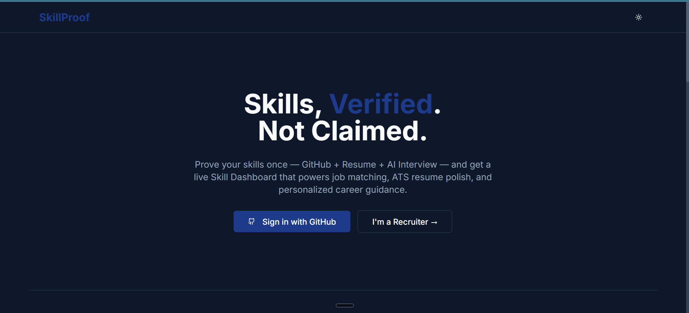
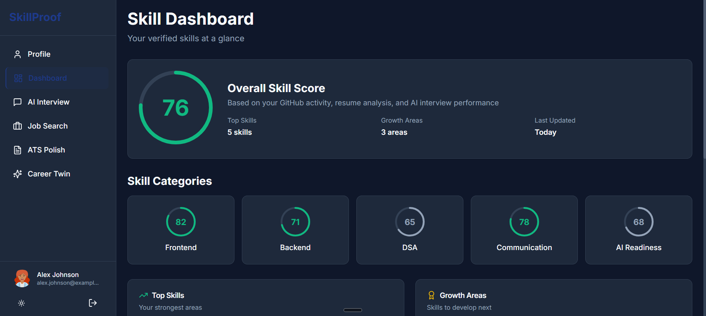
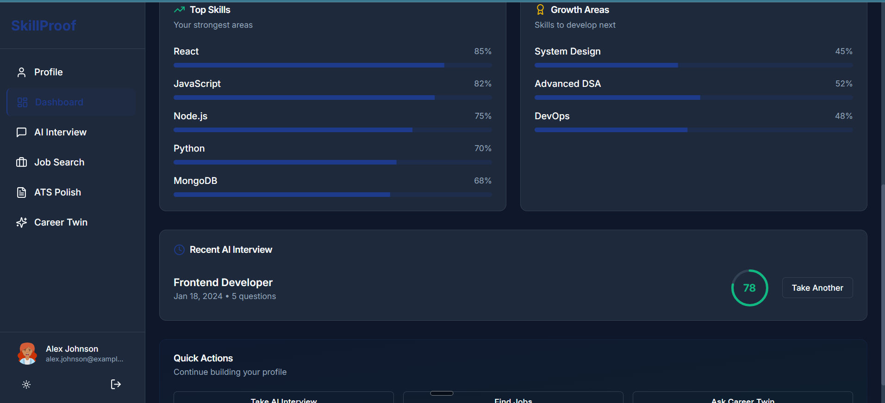
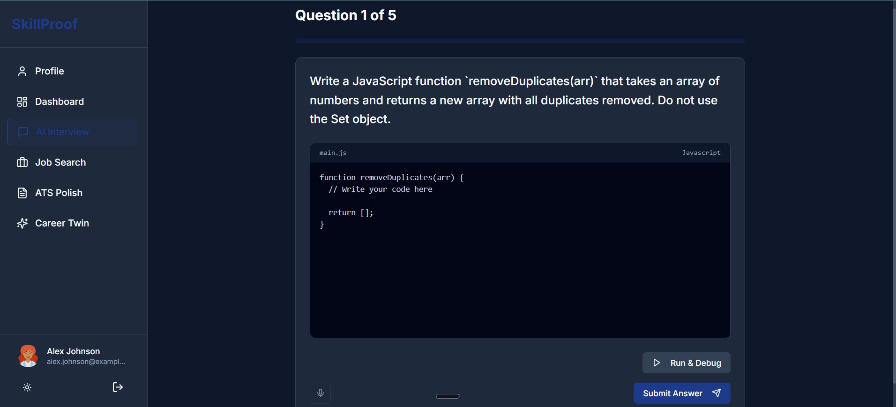
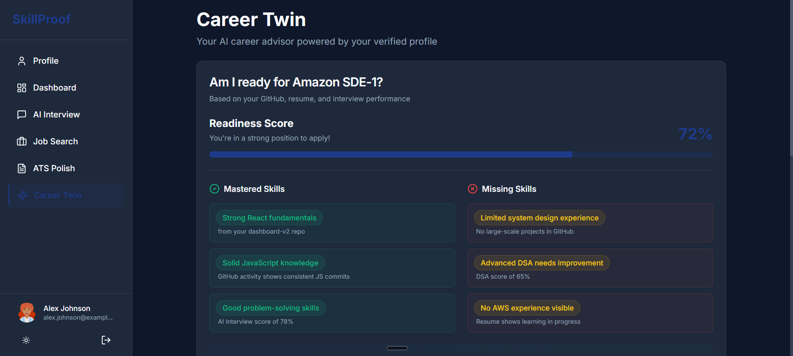
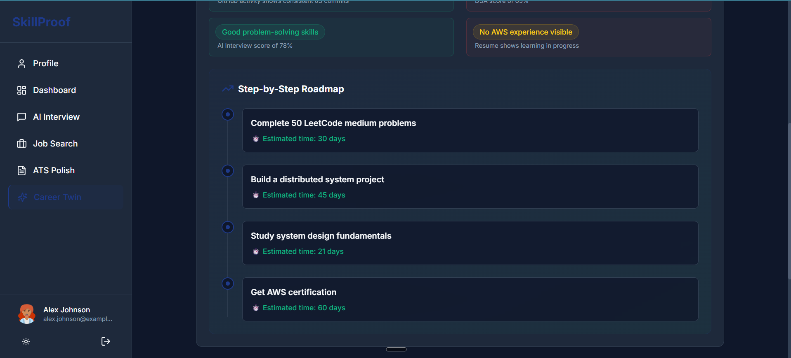
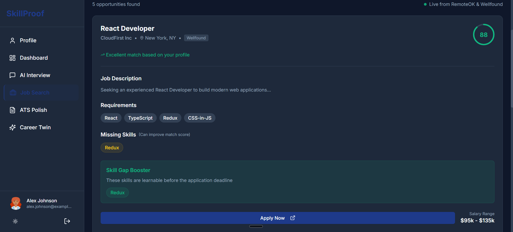
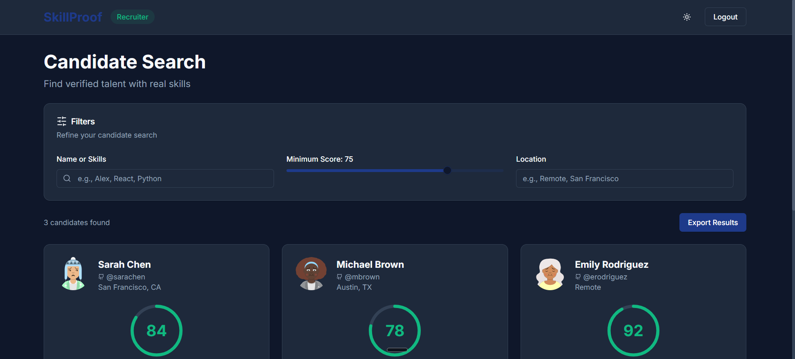
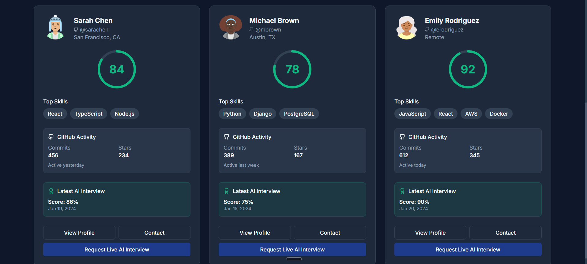

# 🚀 SkillProof: An AI-Ready Career Operating System for Students and Recruiters

> **Skills, Verified. Not Claimed.**
> A dual-sided platform built for the **Nerds Hack Days Lucknow**, designed to bridge the gap between candidates and recruiters through AI-driven technical assessments and automated skill validation.

### 🌐 Live Demo: [https://skillproof-frontend.vercel.app](https://skillproof-frontend-nine.vercel.app/)

> [!IMPORTANT]
> **Hackathon Round 1 Prototype Notice:** 
> This repository represents the UI/UX frontend prototype for the initial submission round and is currently utilizing mock data to demonstrate the seamless user flows. When we advance to the next round and receive the required API credits from the organizers, we will fully integrate our planned FastAPI backend, PostgreSQL database, and live OpenAI endpoints!

---

## 📸 Platform Showcase

### 1. The Landing Page


### 2. Student Skill Dashboard
The centralized hub showing verified scores, skill breakdown, and upcoming interviews.


<br>


### 3. Live AI Interview IDE
An immersive testing environment with real-time code execution and mock test validation.



### 4. Career Twin (AI Advisor)
Context-aware chatbot providing personalized career roadmaps and readiness checks.


<br>


### 5. Smart Job Search
Curated opportunities matching the candidate's verified skills, complete with match scores.


<br>


### 6. ATS Resume Polish
Instant, actionable feedback to ensure your resume bypasses strict ATS filters.


### 7. Recruiter Candidate Discovery
A powerful dashboard for recruiters featuring detailed, slide-out candidate profiles to instantly view GitHub stats and interview performance.


<br>


---

## 📖 The Problem

The current tech hiring process is fundamentally broken for both sides of the table:

* **For Recruiters:** They are flooded with resumes full of self-reported, unverified skills. It is nearly impossible to tell who actually possesses the required technical abilities without conducting expensive and time-consuming manual interviews.
* **For Students:** 
  * **The Resume Black Hole:** Resumes are often unfairly rejected by automated ATS systems due to poor formatting or missing keywords, before a human ever sees them.
  * **No Way to Prove Skills:** Students have no standardized way to practice or prove their actual coding abilities to recruiters *before* landing an interview.
  * **Lack of Mentorship:** Freshers lack personalized guidance to know if their current skills are actually "industry-ready" for specific target companies.
  * **Irrelevant Job Hunting:** Searching for jobs is overwhelming, and candidates waste time applying to roles that don't match their actual, verified skill level.

## 💡 Our Solution
**SkillProof** is a complete Career OS that replaces self-reported claims with hard data. We empower students to build a verifiable profile of their skills, and we give recruiters a dashboard to instantly discover pre-vetted talent.

### For Students
1. **Connect GitHub:** Automatically sync repositories, languages, and commit history.
2. **AI Technical Interviews:** Take a mock technical interview (Code, MCQ, and Theory) directly on the platform. An AI evaluates the answers in real-time and assigns a verified "SkillProof Score".
3. **Career Twin Chatbot:** An AI career advisor that analyzes your current skills, compares them to target roles (e.g., "Am I Amazon ready?"), and provides a tailored roadmap for improvement.
4. **ATS Polish:** Upload a resume and get instant, actionable feedback to bypass strict ATS filters.

### For Recruiters
1. **Recruiter Dashboard:** Search for candidates based on verified skills, location, and minimum SkillProof scores.
2. **Deep-Dive Profiles:** Click into a candidate to view their overall score dial, GitHub commit/star statistics, and detailed AI Interview feedback.
3. **Direct Engagement:** Contact vetted candidates instantly or invite them for live follow-up interviews.

---

## 🛠️ Tech Stack (Frontend Prototype)
This repository contains the frontend prototype designed for the online submission round. 

* **Framework:** React.js
* **Routing:** React Router DOM
* **Styling:** Tailwind CSS + Lucide React Icons
* **UI Components:** Shadcn UI (Radix UI primitives)
* **Build Tool:** CRA + Craco (for path aliases)

*(Note: Data is currently mocked for the hackathon prototype to demonstrate the seamless UI/UX flow before integrating with the backend API).*

---

## 🚀 Future Roadmap & Architecture (Full-Stack)
While this prototype focuses on the frontend user experience, we have architected the platform to smoothly transition into a robust full-stack application in the next phase:

* **Backend API:** **FastAPI (Python)** for high-performance, asynchronous endpoints that handle AI processing effortlessly.
* **Authentication:** Real **GitHub OAuth** integration to securely pull repositories and commit data.
* **Database:** **PostgreSQL** (via SQLAlchemy) to store candidate profiles, recruiter accounts, and historical interview data.
* **AI Engine:** Integration with **OpenAI / LangChain** to power the live, dynamic logic behind the Career Twin chatbot and technical interview scoring.
* **ATS Parsing:** Python-based NLP (e.g., `PyPDF2` + `spaCy`) to extract deep context from uploaded resumes.

---

## 🏃‍♂️ How to Run Locally

1. **Clone the repository**
   ```bash
   git clone https://github.com/Tjshar/skillproof-frontend.git
   cd skillproof-frontend
   ```

2. **Install Dependencies**
   ```bash
   npm install
   ```

3. **Start the Development Server**
   ```bash
   npm start
   ```
   *The application will open automatically at http://localhost:3000*

---

## 🎯 Key Workflows to Test (For Judges)
Since this is an online round, we invite the judges to test the following fully-built UI workflows:

1. **The Mock GitHub Auth:** On the landing page, click `Sign in with GitHub`. Fill out the mock modal to enter the Student Dashboard.
2. **The AI Interview IDE:** Navigate to `AI Interview` -> Select `Frontend Developer` -> Click `Start Interview`. Test the built-in IDE environment, Run & Debug feature, and automated boilerplate injection.
3. **Career Twin Chatbot:** Navigate to `Career Twin` and ask a question like *"Am I Amazon-ready?"* to see how the AI parses the user's profile to give tailored advice.
4. **Recruiter Discovery:** Go back to the landing page and click `I'm a Recruiter`. Search the dashboard and click `View Profile` on any candidate to see the slide-out deep-dive statistics.

---
*built over the weekend for Nerds Hack Days, Lucknow.*
